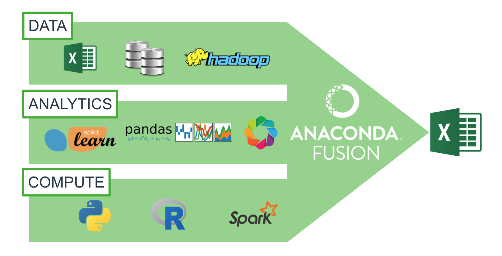

# What is Anaconda?

> Anaconda is a package manager, an environment manager, a Python distribution, and a collection of over 720 open source packages.

- CLI: `conda`
- GUI: Anaconda Navigator

# Continuum Analytics

Other projects supported by Continuum:

- Blaze
- Bokeh
- dask
- Numba
- PhosphorJS
- NumFOCUS

# Why use Anaconda?

> So you can install stuff and it just works.

# Anaconda products (that I don't use)

- Anaconda Repository
- Anaconda Accelerate
- Anaconda Enterprise Notebooks
- Anaconda Adam
- Anaconda Scale
- Anaconda Fusion

